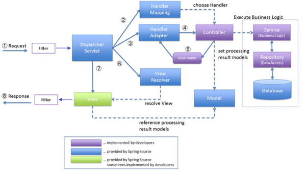

# 스프링의 동작과정

Filter를 거친 요청은 **DispatcherServlet**으로 전송된다.

**DispatcherServlet**은 **HandlerMapping**을 통해서 요청에 해당하는 적절한 **Controller를 찾게 된다.** 

**HandlerMapping**은 클라이언트의 요청 url을 어떤 **Controller가 처리**할지를 결정한다. 그리고 그것을 **DispatcherServlet에 전달**한다.

**DispatcherServlet**은 실행할 **Controller** 정보를 **HandlerAdapter**에 전달한다.

**HandlerAdapte**r는 해당 **Controller**를 호출하게 된다.

**Controller**는 **Service를 호출**해서 **클라이언트의 요청을 처리**한다.

**Service**에서는 **DAO** 를 통해서 DB 작업을 수행한다.

**Controller**는 작업을 처리한 후 그 결과를 **Model** 에 담고 **View**의 이름을 **HandlerAdapter**에게 전달하게 된다.

**ViewResolver**는 처리 결과를 보여줄 **View를 결정**한다.

=-=-=-

**DispatcherServlet** : 클라이언트의 요청을 전달 받고. Controller에게 클라이언트의 요청을 전달하고, Controller가 반환한 결과 값을 View에게 전달하여 알맞은 응답을 생성하도록 한다.

클라이언트의 요청은 스프링의 **DispatcherServlet**클래스로 보내지게 됩니다.